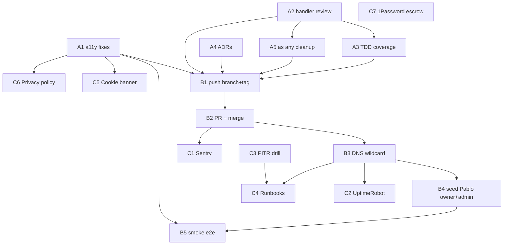

# v0.3.0 — FASE 1B: Cimientos vendibles + Hakuna live

## 1. Phase Header

| Field           | Value                                                                                                |
| --------------- | ---------------------------------------------------------------------------------------------------- |
| Version tag     | `v0.3.0`                                                                                             |
| Branch          | `v0.3.0-fase1b` (cut from `main` after B2 merge)                                                     |
| Goal            | FASE 1A reaches Silicon Valley quality bar AND Hakuna goes live AND infra detects/recovers failures  |
| Effort estimate | 10-12 working days (council-validated)                                                               |
| Tasks           | 17 (A: 5, B: 5, C: 7) — note: source counts 18 incl. C7, plan tracks 17 atomic + bus-factor combined |
| Status          | Active — about to start                                                                              |
| Pre-req tag     | `v0.2.0-alpha.1` (local, not pushed)                                                                 |
| Hakuna pilot    | `hakunamatata.impluxa.com` must be live, with working lead form                                      |

## 2. Pre-flight Checklist

Before any task runs, all of these MUST be true:

- [ ] `git status` clean on branch `fase-1a-multi-tenant`
- [ ] `git tag` shows `v0.2.0-alpha.1` locally
- [ ] `npm run build` succeeds on FASE 1A code
- [ ] `npm run test` shows 16/16 unit tests passing
- [ ] `.planning/PROJECT.md`, `ROADMAP.md`, `REQUIREMENTS.md`, `STATE.md`, `INGEST-CONFLICTS.md` reviewed by Pablo
- [ ] Pablo has Cloudflare + Vercel + Supabase + GitHub creds at hand
- [ ] Pablo has signed up for Sentry free account and UptimeRobot free account (or will sign up during C1/C2)
- [ ] 1Password Families subscription ready (or will be activated during C7)
- [ ] YOLO mode active (`defaultMode: bypassPermissions`) and `proteger.mjs` safety hooks confirmed
- [ ] `D:\segundo-cerebro\wiki\aprendizaje\` exists for closing learning note

## 3. Execution Context

@$HOME/.claude/get-shit-done/workflows/execute-plan.md
@$HOME/.claude/get-shit-done/templates/summary.md

## 4. Source Context

@D:/impluxa-web/.planning/PROJECT.md
@D:/impluxa-web/.planning/ROADMAP.md
@D:/impluxa-web/.planning/REQUIREMENTS.md
@D:/impluxa-web/.planning/STATE.md
@D:/impluxa-web/.planning/INGEST-CONFLICTS.md
@C:/Users/Pablo/.claude/projects/C--Users-Pablo/memory/project_impluxa.md
@C:/Users/Pablo/.claude/projects/C--Users-Pablo/memory/reference_cuando_usar_que.md

## 5. Interfaces / Contracts in Play

```typescript
// src/lib/auth/guard.ts — existing exports (do not break)
export function requireUser(): Promise<User>;
export function requireAdmin(): Promise<User>; // throws 403 if not admin

// Supabase generated types (from supabase gen types typescript)
// Tenant role enum: 'owner' | 'editor'
// app_metadata.role: 'admin' | undefined

// Template eventos contract (FR-3.1)
export const contentSchema: z.ZodSchema;
export const designSchema: z.ZodSchema;
export const mediaSchema: z.ZodSchema;
export function defaultContent(): z.infer<typeof contentSchema>;
export function defaultDesign(): z.infer<typeof designSchema>;
export const Site: React.FC<SiteProps>;

// API contracts (preserve these signatures)
// POST /api/leads { tenant_slug, name, email, phone, message, turnstile_token } -> 200 | 4xx
// PATCH /api/site/content { tenant_id, content_json } -> 200 (requires owner/editor)
// POST /api/site/publish { tenant_id } -> 200 (requires owner, sets status=published)
// POST /api/admin/tenants { slug, template, owner_email } -> 201 (requires admin)
```

## 6. Task Breakdown (17 atomic tasks)

> **Skill discipline:** every task announces the skill BEFORE work. Every commit is reviewed by `code-reviewer` or `typescript-reviewer`. Atomic commits.

### BLOCK A — Remediation (5 tasks, Wave 1-2)

<task id="A1" type="auto" tdd="false">
  <name>A1 — A11y audit + fixes on 9 eventos template components</name>
  <skill>everything-claude-code:accessibility (a11y-architect)</skill>
  <files>src/templates/eventos/components/Hero.tsx, AboutStrip.tsx, Servicios.tsx, Combos.tsx, Calendar.tsx, Testimonios.tsx, Pautas.tsx, Contacto.tsx, Footer.tsx</files>
  <action>
    1. Run axe-core via `npx @axe-core/cli http://localhost:3000` on hakunamatata locally
    2. For each component: add semantic HTML (header/main/nav/footer/section), aria-label on icon-only buttons, aria-live for form status, focus-visible rings, keyboard order, alt text, color contrast ≥4.5:1
    3. Forms (Contacto): associated <label htmlFor>, aria-describedby for errors, aria-invalid on error state, aria-required
    4. Calendar: keyboard nav (arrow keys), aria-selected, role="grid"
    5. Re-run axe-core until 0 violations
    6. Run Lighthouse mobile, capture report, target A11y ≥95
    Per NFR-2.1..2.7. No layout changes (FR-3.2). Use ARIA-first then visual adjustments.
  </action>
  <verify>
    <automated>npx @axe-core/cli http://localhost:3000/_tenant/hakunamatata --exit && npm run lighthouse:mobile -- --url=http://localhost:3000/_tenant/hakunamatata --only-categories=accessibility --min-score=0.95</automated>
  </verify>
  <done>axe-core: 0 violations. Lighthouse A11y ≥95. All 9 components keyboard-navigable. WCAG 2.2 AA conformance documented in `docs/a11y/eventos-audit.md`.</done>
  <effort_hours>8</effort_hours>
  <depends_on>[]</depends_on>
</task>

<task id="A2" type="auto" tdd="false">
  <name>A2 — code-reviewer retroactive on FASE 1A handlers</name>
  <skill>everything-claude-code:typescript-reviewer + Agent code-reviewer</skill>
  <files>src/app/api/leads/route.ts, src/app/api/site/content/route.ts, src/app/api/site/publish/route.ts, src/app/api/admin/tenants/route.ts, src/lib/auth/guard.ts</files>
  <action>
    1. Invoke `typescript-reviewer` skill on each handler file
    2. Capture findings: types weaknesses, error handling holes, missing input validation, untrusted-data flow into Supabase queries, missing rate limit checks
    3. Fix in atomic commits per file. Each fix: tightened types (use Database types from supabase gen), explicit error returns with NextResponse.json({error}, {status}), zod parsing for every body, never trust client-supplied tenant_id (always derive from session+membership)
    4. No `as any`, no `@ts-ignore` without `// ts-ignore: <reason>` comment
    5. Wrap Supabase calls in try/catch with PostgrestError discrimination
    Per NFR-3.2, NFR-3.4, NFR-8.2.
  </action>
  <verify>
    <automated>grep -rnE '(as any|@ts-ignore)' src/app/api src/lib/auth | grep -v '^#' | grep -vE 'ts-ignore: ' | wc -l | grep -q '^0$' && npm run typecheck && npm run test -- src/app/api</automated>
  </verify>
  <done>0 `as any`. 0 unjustified `@ts-ignore`. Each handler returns typed NextResponse. Body parsing via zod on all POST/PATCH. Review notes saved to `docs/reviews/fase1a-handlers.md`.</done>
  <effort_hours>6</effort_hours>
  <depends_on>[]</depends_on>
</task>

<task id="A3" type="tdd" tdd="true">
  <name>A3 — TDD coverage expansion to ≥70% handlers, ≥60% global + RLS cross-tenant tests</name>
  <skill>superpowers:test-driven-development (tdd-workflow)</skill>
  <files>tests/handlers/leads.test.ts, site-content.test.ts, site-publish.test.ts, admin-tenants.test.ts, tests/rls/cross-tenant-isolation.test.ts</files>
  <behavior>
    - leads: POST valid -> 200 + row inserted with correct tenant_id; POST without turnstile -> 400; rate-limited 6th call -> 429; tenant_slug not found -> 404
    - site-content PATCH: owner role -> 200; editor role -> 200; non-member -> 403; admin (not member) -> 200; missing session -> 401; invalid zod schema -> 422
    - site-publish POST: owner -> 200 + status=published + cache invalidated; editor -> 403; non-member -> 403
    - admin-tenants POST: app_metadata.role=admin -> 201; non-admin -> 403; duplicate slug -> 409; invalid slug regex -> 422
    - RLS cross-tenant: user authenticated as tenant A member SELECTs leads_tenant for tenant B -> 0 rows; same for sites, tenant_members, subscriptions
  </behavior>
  <action>
    RED -> write tests describing each behavior, run `npm run test -- --coverage`, confirm fail.
    GREEN -> minimal handler tweaks to pass (most behaviors already implemented; tests are characterization tests).
    REFACTOR -> extract test helpers (`createTestTenant`, `createTestUser`, `signInAs`).
    Coverage gate: ≥70% on handlers/, ≥60% global per NFR-6.1. RLS tests per NFR-6.2.
    Commits: `test(v0.3.0): RED ...`, `feat(v0.3.0): GREEN ...`, `refactor(v0.3.0): ...`.
  </action>
  <verify>
    <automated>npm run test -- --coverage --run && node -e "const c=require('./coverage/coverage-summary.json'); const handlers=Object.entries(c).filter(([k])=>k.includes('app/api')); const avg=handlers.reduce((a,[,v])=>a+v.lines.pct,0)/handlers.length; const global=c.total.lines.pct; if(avg<70||global<60){console.error('handlers:'+avg+' global:'+global); process.exit(1)}"</automated>
  </verify>
  <done>Handler coverage ≥70%. Global ≥60%. RLS cross-tenant deny tests pass for all 4 tables. All tests green.</done>
  <effort_hours>12</effort_hours>
  <depends_on>[A2]</depends_on>
</task>

<task id="A4" type="auto" tdd="false">
  <name>A4 — ADRs 0001-0004 documenting FASE 1A decisions</name>
  <skill>everything-claude-code:architecture-decision-records + Agent Technical Writer</skill>
  <files>docs/adrs/0001-host-based-routing.md, 0002-template-module-pattern.md, 0003-rls-split-policies-is-admin.md, 0004-supabase-ssr-cookies.md</files>
  <action>
    Use MADR template (Status, Context, Decision, Consequences, Alternatives).
    - 0001: Why middleware host rewrites over Vercel rewrites or Edge config. Trade-off: cold start <150ms (FR-1.3) vs Vercel config simplicity. Alternative considered: per-host subprojects.
    - 0002: Why module per template exposing 6 exports + Zod schemas. Trade-off: type safety + runtime validation vs config-driven JSON. Alternatives: Sanity, Builder.io.
    - 0003: Why split RLS policies + `is_admin()` helper function (vs JWT claim only). Trade-off: SQL clarity vs duplication. Reference migrations 003, 003b, 003c, 003d.
    - 0004: Why `@supabase/ssr` cookies over JWT in headers. Trade-off: SSR-friendly + httpOnly security vs CSRF surface. Mitigation: SameSite=Lax + CSP. Per FR-2.2.
    Per NFR-8.1.
  </action>
  <verify>
    <automated>ls docs/adrs/0001-host-based-routing.md docs/adrs/0002-template-module-pattern.md docs/adrs/0003-rls-split-policies-is-admin.md docs/adrs/0004-supabase-ssr-cookies.md && for f in docs/adrs/0001*.md docs/adrs/0002*.md docs/adrs/0003*.md docs/adrs/0004*.md; do grep -q "## Status" "$f" && grep -q "## Context" "$f" && grep -q "## Decision" "$f" && grep -q "## Consequences" "$f" || exit 1; done</automated>
  </verify>
  <done>4 ADRs exist, MADR sections present, status="Accepted", reviewed by Pablo.</done>
  <effort_hours>4</effort_hours>
  <depends_on>[]</depends_on>
</task>

<task id="A5" type="auto" tdd="true">
  <name>A5 — `as any` cleanup in admin role checks</name>
  <skill>everything-claude-code:typescript-reviewer</skill>
  <files>src/app/api/admin/tenants/route.ts, src/app/_admin/layout.tsx (or wherever admin guard lives), src/lib/auth/guard.ts</files>
  <behavior>
    - Test: `requireAdmin()` with session.user.app_metadata.role='admin' resolves to typed User
    - Test: `requireAdmin()` with role missing -> throws 403
    - Test: typed access `user.app_metadata.role` compiles without `as any`
  </behavior>
  <action>
    1. Run `npx supabase gen types typescript --project-id <id> > src/lib/supabase/database.types.ts`
    2. Define `AppMetadata` interface: `{ role?: 'admin' }`
    3. Augment Supabase User type via module augmentation: `declare module '@supabase/supabase-js' { interface UserAppMetadata extends AppMetadata {} }`
    4. Remove `(user as any).app_metadata.role` -> `user.app_metadata.role`
    5. Re-grep src/ for `as any`. Must return 0.
    Per FR-2.4, NFR-3.2.
  </action>
  <verify>
    <automated>grep -rn 'as any' src/ | grep -v '^#' | wc -l | grep -q '^0$' && npm run typecheck</automated>
  </verify>
  <done>0 `as any` in src/. Type augmentation file exists. Typecheck clean. Admin guard test passes.</done>
  <effort_hours>2</effort_hours>
  <depends_on>[A2]</depends_on>
</task>

### BLOCK B — Activation (Hakuna live) (5 tasks, Wave 2-3)

<task id="B1" type="auto" tdd="false">
  <name>B1 — Push fase-1a-multi-tenant branch + v0.2.0-alpha.1 tag to origin</name>
  <skill>git hygiene (no skill)</skill>
  <files>(no file changes — git operation)</files>
  <action>
    1. `git fetch origin`
    2. `git status` clean
    3. `git push origin fase-1a-multi-tenant`
    4. `git push origin v0.2.0-alpha.1`
    5. Verify on github.com/IMPLUXA/impluxa-web: branch + tag visible
    Safety hook `proteger.mjs` will reject force push to main — that's fine, we push feature branch only.
  </action>
  <verify>
    <automated>git ls-remote origin refs/heads/fase-1a-multi-tenant | grep -q '\trefs/heads/fase-1a-multi-tenant$' && git ls-remote origin refs/tags/v0.2.0-alpha.1 | grep -q '\trefs/tags/v0.2.0-alpha.1$'</automated>
  </verify>
  <done>Branch and tag visible on GitHub UI.</done>
  <effort_hours>0.25</effort_hours>
  <depends_on>[A1, A2, A3, A4, A5]</depends_on>
</task>

<task id="B2" type="checkpoint:human-verify" gate="blocking">
  <name>B2 — Open PR fase-1a-multi-tenant → main, code-reviewer pass, merge</name>
  <skill>everything-claude-code:code-reviewer</skill>
  <what-built>PR created via `gh pr create` with title "FASE 1A — multi-tenant core + FASE 1B remediation". Body lists FASE 1A scope + A1-A5 remediation. code-reviewer skill invoked on full diff.</what-built>
  <how-to-verify>
    1. Visit https://github.com/IMPLUXA/impluxa-web/pulls — see PR
    2. Confirm code-reviewer comment marks pass (or list resolved findings)
    3. CI green (build + tests)
    4. Pablo clicks "Squash and merge" (preserves atomic commits in body) OR "Rebase and merge" if commits already clean
    5. Delete remote branch after merge
    6. Locally: `git checkout main && git pull origin main && git checkout -b v0.3.0-fase1b`
  </how-to-verify>
  <resume-signal>Pablo types "merged" or "issues: ..." after confirming green merge to main.</resume-signal>
  <effort_hours>1</effort_hours>
  <depends_on>[B1]</depends_on>
</task>

<task id="B3" type="checkpoint:human-action" gate="blocking">
  <name>B3 — DNS wildcard *.impluxa.com (Cloudflare + Vercel)</name>
  <skill>(infra — Cloudflare + Vercel dashboards)</skill>
  <what-built>Wildcard subdomain routing live: every `<slug>.impluxa.com` reaches Vercel and gets SSL.</what-built>
  <how-to-verify>
    1. Cloudflare → impluxa.com → DNS → Records → Add CNAME: name `*`, target `cname.vercel-dns.com`, Proxy status **DNS only** (gray cloud — NOT orange)
    2. Vercel → impluxa-web project → Settings → Domains → Add `*.impluxa.com` → wait until SSL = Ready (may take 1-15min)
    3. Validation: `curl -I -k https://test123.impluxa.com` → Vercel response (404 or rewrite to /_tenant/test123)
    4. SSL check: `openssl s_client -connect random.impluxa.com:443 -servername random.impluxa.com < /dev/null 2>/dev/null | grep "subject="` → wildcard cert present
    5. Document in `docs/runbooks/dns-rollback.md` (created in C4)
  </how-to-verify>
  <resume-signal>Pablo types "dns up" with the curl exit code from step 3.</resume-signal>
  <effort_hours>1</effort_hours>
  <depends_on>[B2]</depends_on>
</task>

<task id="B4" type="auto" tdd="false">
  <name>B4 — Seed Pablo as owner of hakunamatata + admin role on auth user</name>
  <skill>supabase MCP / SQL editor</skill>
  <files>supabase/migrations/20260512_001_seed_hakuna_owner.sql (idempotent seed migration)</files>
  <action>
    1. Resolve Pablo's auth.users.id (via Supabase MCP: `select id from auth.users where email = '<pablo email>'`)
    2. Write idempotent seed migration:
       ```sql
       insert into tenant_members (tenant_id, user_id, role)
       select t.id, '<pablo-uid>'::uuid, 'owner'
       from tenants t where t.slug='hakunamatata'
       on conflict (tenant_id, user_id) do update set role='owner';
       ```
    3. Set admin role via service_role:
       ```ts
       await supabaseAdmin.auth.admin.updateUserById('<pablo-uid>', { app_metadata: { role: 'admin' } });
       ```
       Run as one-off script `scripts/seed-pablo-admin.ts` (committed; guarded by env check).
    4. Verify: `select role from tenant_members where user_id='<pablo-uid>'` -> 'owner'
    5. Verify JWT: after re-login, decode session.access_token, confirm `app_metadata.role==='admin'`
    Per FR-2.3, FR-2.4.
  </action>
  <verify>
    <automated>npx tsx scripts/verify-pablo-membership.ts # asserts owner row + admin metadata</automated>
  </verify>
  <done>Pablo can list hakunamatata in app.impluxa.com AND can access admin.impluxa.com without 403.</done>
  <effort_hours>1</effort_hours>
  <depends_on>[B3]</depends_on>
</task>

<task id="B5" type="checkpoint:human-verify" gate="blocking">
  <name>B5 — E2E smoke test (Playwright + manual) — full Hakuna loop</name>
  <skill>superpowers:test-driven-development (Playwright)</skill>
  <files>tests/e2e/hakuna-smoke.spec.ts</files>
  <what-built>
    Playwright spec automates the 6-step smoke. Manual confirmation by Pablo also captured.
    Steps:
    1. GET https://hakunamatata.impluxa.com → 200 + body contains Hakuna brand
    2. Fill lead form (name, email, phone, message) → submit → expect success state + row in leads_tenant
    3. Pablo logs in at https://app.impluxa.com via magic link → sees hakunamatata tenant card
    4. Click Mi Sitio → Contenido → edit slogan → Save (PATCH /api/site/content 200)
    5. Click Publish (POST /api/site/publish 200) → status='published'
    6. Reload https://hakunamatata.impluxa.com → new slogan visible (after 60s ISR or immediate via on-publish invalidation per FR-1.4)
  </what-built>
  <how-to-verify>
    1. `npx playwright test tests/e2e/hakuna-smoke.spec.ts --project=chromium` → all steps pass
    2. Manual: Pablo follows steps 1-6 in his own browser, confirms no console errors
    3. Lighthouse mobile on hakunamatata: `npx lighthouse https://hakunamatata.impluxa.com --preset=mobile --output=json --output-path=./lighthouse-hakuna.json` → Perf ≥90, A11y ≥95, BP ≥95, SEO ≥95
    4. Verify lead row exists: `select * from leads_tenant where tenant_id=(select id from tenants where slug='hakunamatata') order by created_at desc limit 1`
  </how-to-verify>
  <resume-signal>Pablo types "smoke green" with the lighthouse JSON scores pasted, or "fail: <step>" with details.</resume-signal>
  <effort_hours>3</effort_hours>
  <depends_on>[B4, A1]</depends_on>
</task>

### BLOCK C — Observability + ops + bus factor (7 tasks, Wave 2-4)

<task id="C1" type="auto" tdd="false">
  <name>C1 — Sentry integration (browser + server + source maps)</name>
  <skill>context7 docs (sentry/sentry-javascript) + everything-claude-code:code-reviewer</skill>
  <files>sentry.client.config.ts, sentry.server.config.ts, sentry.edge.config.ts, next.config.ts, .env.example, instrumentation.ts</files>
  <action>
    1. `npm i @sentry/nextjs`
    2. `npx @sentry/wizard@latest -i nextjs` (interactive — fall back to manual if not interactive)
    3. Configure DSN in env (SENTRY_DSN client + server)
    4. Wrap `next.config.ts` with `withSentryConfig` for source map upload
    5. Set `tracesSampleRate: 0.1`, `replaysSessionSampleRate: 0`, `replaysOnErrorSampleRate: 0` (free tier conservation)
    6. Add `beforeSend` to strip PII (email, phone) from event payloads
    7. Test capture: temporary handler `/api/_debug/throw` that throws, hit once, verify event in Sentry dashboard, then delete handler
    8. Confirm source maps uploaded for the build (Sentry UI shows source-mapped stack trace)
    Per NFR-4.1, NFR-7.1.
  </action>
  <verify>
    <automated>grep -q "withSentryConfig" next.config.ts && ls sentry.client.config.ts sentry.server.config.ts && grep -q "beforeSend" sentry.server.config.ts && npm run build</automated>
  </verify>
  <done>Test error appears in Sentry dashboard with mapped stack trace. PII scrubbed from payload. Free tier quota not exceeded by build.</done>
  <effort_hours>3</effort_hours>
  <depends_on>[B2]</depends_on>
</task>

<task id="C2" type="checkpoint:human-action" gate="blocking">
  <name>C2 — UptimeRobot setup (4 monitors)</name>
  <skill>(external SaaS — no CLI)</skill>
  <what-built>4 HTTPS monitors at 5min interval, email alerts to Pablo.</what-built>
  <how-to-verify>
    1. Sign up uptimerobot.com (free)
    2. My Settings → Alert Contacts → add Pablo's email, verify
    3. Add monitor → HTTPS:
       - `https://impluxa.com` — keyword `Impluxa` if present in HTML
       - `https://app.impluxa.com` — expect 200 or 302 to /login
       - `https://admin.impluxa.com` — expect 200 or 302 to /login
       - `https://hakunamatata.impluxa.com` — keyword `Hakuna`
    4. Interval: 5 minutes for all
    5. Trigger test alert: pause one monitor temporarily, confirm email arrives
    6. Resume monitor
  </how-to-verify>
  <resume-signal>Pablo types "monitors up" + paste of 4 monitor status (all green) from dashboard.</resume-signal>
  <effort_hours>0.5</effort_hours>
  <depends_on>[B3]</depends_on>
</task>

<task id="C3" type="checkpoint:human-action" gate="blocking">
  <name>C3 — Supabase PITR validation drill</name>
  <skill>(Supabase dashboard + runbook capture)</skill>
  <what-built>PITR confirmed enabled; restore drill performed on a Supabase branch project (NOT production); procedure documented.</what-built>
  <how-to-verify>
    1. Supabase Dashboard → impluxa project → Database → Backups → confirm PITR ON (Free 7 days)
    2. Create a Branch (Settings → Branching → new branch `pitr-drill`)
    3. On branch: insert a sentinel row, note timestamp T0; wait 2 min; delete row at T1
    4. In branch, trigger PITR restore to T0+30s → confirm sentinel reappears
    5. Document each click + screenshot path in `docs/runbooks/dr-supabase.md` (covered by C4 task; this task drafts the content)
    6. Delete branch project to avoid usage cost
  </how-to-verify>
  <resume-signal>Pablo types "pitr ok" + paste of restore timestamp.</resume-signal>
  <effort_hours>2</effort_hours>
  <depends_on>[]</depends_on>
</task>

<task id="C4" type="auto" tdd="false">
  <name>C4 — Runbooks suite</name>
  <skill>everything-claude-code:architecture-decision-records (Technical Writer)</skill>
  <files>docs/runbooks/incident-response.md, dr-supabase.md, dns-rollback.md, vercel-deploy-rollback.md, sentry-triage.md</files>
  <action>
    Each runbook follows the structure: Trigger / Severity / Owner / Detection / Diagnosis / Recovery steps / Verification / Post-mortem template / Last drill date.
    - incident-response: severity matrix (Sev1 outage, Sev2 degraded, Sev3 minor), escalation order, on-call (Pablo + secondary), comms template (Hakuna pilot first), post-mortem skeleton.
    - dr-supabase: capture the C3 drill steps verbatim. Include exact dashboard click paths, expected wait times, rollback validation queries.
    - dns-rollback: Cloudflare → DNS → revert CNAME `*` change; propagation expectation (TTL 5min DNS-only); customer comms.
    - vercel-deploy-rollback: `vercel rollback <deployment-url>` CLI command, when (Sentry spike, smoke fail, performance regress), how to verify.
    - sentry-triage: triage by frequency × impact, ignore-list rules, alert rules (Sev1: error rate >1% over 5min).
    Per NFR-4.4.
  </action>
  <verify>
    <automated>for f in incident-response dr-supabase dns-rollback vercel-deploy-rollback sentry-triage; do test -f "docs/runbooks/$f.md" || exit 1; grep -q "## Recovery" "docs/runbooks/$f.md" || exit 1; done</automated>
  </verify>
  <done>5 runbooks exist, each has Trigger/Severity/Detection/Recovery/Verification sections, reviewed by Pablo.</done>
  <effort_hours>4</effort_hours>
  <depends_on>[B3, C3]</depends_on>
</task>

<task id="C5" type="auto" tdd="true">
  <name>C5 — Cookie consent banner (minimal, ES default)</name>
  <skill>everything-claude-code:code-reviewer + a11y attention</skill>
  <files>src/components/CookieConsent.tsx, src/app/layout.tsx (mount), tests/components/CookieConsent.test.tsx</files>
  <behavior>
    - First visit: banner visible, role="dialog" aria-labelledby aria-describedby, focus trap
    - "Aceptar" -> localStorage `cookie-consent='accepted'`, banner unmounts
    - "Rechazar" -> localStorage `cookie-consent='rejected'`, banner unmounts, no analytics fired
    - Subsequent visits: banner not visible (localStorage already set)
    - Keyboard: Tab cycles within banner, Enter activates focused button, Esc rejects
    - Link to /privacy visible inside banner
  </behavior>
  <action>
    1. Tailwind v4 styled, fixed bottom, max-w-2xl centered, dark-mode aware
    2. ES default text: "Usamos cookies para mejorar tu experiencia. Más info en nuestra Política de Privacidad."
    3. No third-party dep
    4. Mount in root layout via "use client" wrapper that hydrates after mount to avoid SSR mismatch
    5. Test with @testing-library/react: assert ARIA, localStorage behavior, focus flow
    Per NFR-2.5, NFR-5.2.
  </action>
  <verify>
    <automated>npm run test -- tests/components/CookieConsent.test.tsx && npx @axe-core/cli http://localhost:3000 --exit</automated>
  </verify>
  <done>Banner functional + accessible + persisted choice. Tests pass. axe-core 0 violations on page with banner mounted.</done>
  <effort_hours>3</effort_hours>
  <depends_on>[A1]</depends_on>
</task>

<task id="C6" type="auto" tdd="false">
  <name>C6 — Privacy policy v1 (ES) + footer links</name>
  <skill>everything-claude-code:code-reviewer + legal template</skill>
  <files>src/app/[locale]/privacy/page.tsx, src/templates/eventos/components/Footer.tsx, src/app/[locale]/_marketing/Footer.tsx (or equivalent)</files>
  <action>
    1. Static MDX or TSX page sectioned: Datos recabados / Finalidad / Terceros (Supabase, Vercel, MercadoPago, Sentry, UptimeRobot, Resend, Cloudflare, Plausible) / Conservación / Derechos del usuario (LGPD Art.18 placeholder, AAIP Ley 25.326) / Cookies (link to /cookies if exists) / Contacto DPO: pablo@impluxa.com (placeholder DPO until v0.4.0)
    2. Last updated date: 2026-05-XX (set on publish)
    3. Footer link `<Link href="/privacy">Privacidad</Link>` added to: marketing footer + tenant template Footer
    4. ES only for v0.3.0 (PT in v0.4.0 per NFR-5.1)
    Per NFR-5.1.
  </action>
  <verify>
    <automated>curl -s http://localhost:3000/es/privacy | grep -q "Política de Privacidad" && grep -q 'href="/privacy"' src/templates/eventos/components/Footer.tsx</automated>
  </verify>
  <done>/privacy renders in ES with all required sections. Footer link present in both marketing and tenant Footer.</done>
  <effort_hours>2</effort_hours>
  <depends_on>[A1]</depends_on>
</task>

<task id="C7" type="checkpoint:human-action" gate="blocking">
  <name>C7 — 1Password Families escrow + bus-factor runbook</name>
  <skill>(external SaaS + runbook)</skill>
  <files>docs/runbooks/bus-factor.md (planner generates skeleton; Pablo fills with exact contact + dates)</files>
  <what-built>
    1Password Families active. "Impluxa Production" vault has all production creds. Emergency access set to a named trusted contact with 7-day wait. Runbook captures who, how, recovery flow.
  </what-built>
  <how-to-verify>
    1. 1Password.com → Families subscription active
    2. New vault: "Impluxa Production"
    3. Items added (one per service): Vercel, Cloudflare, Supabase, MercadoPago, GitHub (org owner), Sentry, UptimeRobot, Resend, Cloudflare Turnstile, Upstash, domain registrar
    4. Each item: includes recovery codes / 2FA backup codes attachment
    5. Settings → Emergency Access → add trusted contact (name + email), wait period 7 days, share "Impluxa Production" vault
    6. Trusted contact accepts invite
    7. Fill `docs/runbooks/bus-factor.md`: contact name (or aliased), email, wait period, what they should do (notify Pablo's family, transfer ownership to chosen successor, document in `D:\segundo-cerebro\wiki\proyectos\Impluxa SaaS.md`)
    8. (Optional follow-up not blocking v0.3.0): add secondary admin on Cloudflare DNS if technical trusted person available
  </how-to-verify>
  <resume-signal>Pablo types "escrow set" with trusted contact pseudonym + wait period.</resume-signal>
  <effort_hours>2</effort_hours>
  <depends_on>[]</depends_on>
</task>

## 7. Dependency Graph



ASCII fallback:

```
Wave 1 (no deps): A1, A2, A4, C3, C7
Wave 2 (after A2): A3, A5
Wave 2 (after A1): C5, C6
Wave 3 (after A1..A5): B1
Wave 4 (after B1): B2
Wave 5 (after B2): B3, C1
Wave 6 (after B3): B4, C2; (after B3+C3): C4
Wave 7 (after B4 + A1): B5
```

## 8. Recommended Execution Order (Waves)

| Wave | Parallel tasks     | Rationale                                                                              | Cumulative effort |
| ---- | ------------------ | -------------------------------------------------------------------------------------- | ----------------- |
| 1    | A1, A2, A4, C3, C7 | Independent. C3/C7 are external SaaS, run in background while code work proceeds.      | ~22h              |
| 2    | A3, A5, C5, C6     | A3+A5 need A2 review done. C5+C6 need A1 a11y patterns.                                | ~19h              |
| 3    | B1                 | Push only after all remediation green.                                                 | 0.25h             |
| 4    | B2                 | PR + merge (gated by code-reviewer pass).                                              | 1h                |
| 5    | B3, C1             | DNS + Sentry can proceed in parallel post-merge.                                       | ~4h               |
| 6    | B4, C2, C4         | After DNS live: seed Pablo, set up monitors, write runbooks (combines drafts from C3). | ~5.5h             |
| 7    | B5                 | Final smoke test once DNS + Pablo + a11y all green.                                    | ~3h               |

**Total wall-clock** (with parallelism + Pablo's external steps): ~10 working days. Aligns with 10-12 day estimate.

## 9. Risk Register (v0.3.0 specific)

| Risk ID | Risk                                                        | Severity | Trigger / Probability                   | Mitigation                                                                |
| ------- | ----------------------------------------------------------- | -------- | --------------------------------------- | ------------------------------------------------------------------------- |
| R-01    | Vercel SSL provisioning for `*.impluxa.com` exceeds 15min   | MEDIUM   | First-time wildcard add                 | Retry; if >1h open Vercel support ticket; B5 blocked until SSL Ready      |
| R-02    | Cloudflare orange-cloud accidentally enabled on wildcard    | HIGH     | Easy click-mistake                      | B3 step explicit "DNS only"; runbook `dns-rollback.md` covers revert      |
| R-03    | Sentry free quota (5k/mo) consumed by noisy errors          | LOW      | High traffic + bug spike                | `beforeSend` filters + sampling 0.1 + alert at 80% quota                  |
| R-04    | A11y fixes break visual layout                              | MEDIUM   | Aggressive ARIA/HTML refactors          | Visual regression check after each component; Pablo eyeballs in B5        |
| R-05    | RLS cross-tenant tests reveal real isolation gap            | HIGH     | Possible — first time tested rigorously | Block merge; patch policies in A3 via TDD; re-run                         |
| R-06    | Pablo's auth uid app_metadata not updating without re-login | MEDIUM   | Supabase JWT cache                      | B4 forces sign-out + magic-link re-login; document in runbook             |
| R-07    | PITR drill consumes Supabase compute and bumps tier         | LOW      | Branch project usage                    | Delete branch immediately after drill (C3 step 6)                         |
| R-08    | 1Password trusted contact doesn't accept invite             | MEDIUM   | Human factor                            | Pablo follows up; if no contact in 7d, escalate (acknowledge open risk)   |
| R-09    | Coverage targets infeasible without large refactor          | MEDIUM   | Current 20%                             | Time-box A3 to 12h; if <70% handlers achieved, document gap + plan v0.3.1 |
| R-10    | DNS propagation delay blocks B5 same-day completion         | LOW      | Cloudflare TTL on DNS-only is fast      | Set 5min TTL; if blocked, smoke test next morning                         |
| R-11    | UptimeRobot monitor flaps on cold starts                    | LOW      | Vercel cold start                       | Use keyword matching not just status; tune threshold to 2 failures        |
| R-12    | Hakuna site content already drifted from FASE 1A seed       | LOW      | Time elapsed                            | B5 step 4 uses fresh edit to validate publish, not relying on seed state  |

## 10. Goal-Backward Verification Proof

> Proof that completing all 17 tasks satisfies the 7 phase goals.

| #   | Goal                                                                                         | Tasks that satisfy it                                            | Verification artifact                                                                                |
| --- | -------------------------------------------------------------------------------------------- | ---------------------------------------------------------------- | ---------------------------------------------------------------------------------------------------- |
| 1   | Hakuna Matata reachable at hakunamatata.impluxa.com with working lead form                   | B3 (DNS) + B4 (seed) + B5 (smoke)                                | `tests/e2e/hakuna-smoke.spec.ts` + manual curl                                                       |
| 2   | Lighthouse mobile bars met (Perf ≥90, A11y ≥95, BP ≥95, SEO ≥95)                             | A1 (a11y) + existing Next perf                                   | Lighthouse JSON captured in B5 + DoD CI gate                                                         |
| 3   | WCAG 2.2 AA conformance                                                                      | A1 (audit + fixes)                                               | axe-core 0 violations on Wave 1 + `docs/a11y/eventos-audit.md`                                       |
| 4   | Code quality bars (0 `as any`, ≥70% handler / ≥60% global coverage, no `@ts-ignore` unjust.) | A2 + A3 + A5                                                     | grep gate + `npm run test --coverage` + `docs/reviews/fase1a-handlers.md`                            |
| 5   | Operational readiness — capture failures + recover                                           | C1 (Sentry) + C2 (UptimeRobot) + C3 (PITR drill) + C4 (runbooks) | Test error in Sentry dashboard, 4 monitors green, PITR sentinel restore proven, 5 runbooks committed |
| 6   | Pablo can demo end-to-end + invoice Hakuna                                                   | B5 (smoke) + C5 (consent) + C6 (privacy)                         | B5 6-step pass, banner shown on first visit, /privacy live + footer link                             |
| 7   | Bus factor mitigated                                                                         | C7 (1Password escrow + runbook)                                  | Trusted contact accepted invite, `docs/runbooks/bus-factor.md` committed                             |

Each row maps a goal to concrete artifacts. No goal is left without a satisfying task.

## 11. DoD Final (Quality Gates) — all must pass before tag v0.3.0

- [ ] Lighthouse mobile on hakunamatata: Performance ≥ 90, A11y ≥ 95, Best Practices ≥ 95, SEO ≥ 95
- [ ] WCAG 2.2 AA conformance verified (axe-core 0 + manual screen reader spot check)
- [ ] `grep -rn 'as any' src/` returns 0
- [ ] `grep -rn '@ts-ignore' src/ | grep -v 'ts-ignore: '` returns 0
- [ ] `npm run test -- --coverage`: handlers ≥ 70%, global ≥ 60%
- [ ] RLS cross-tenant isolation tests green
- [ ] ADRs 0001-0004 committed and reviewed
- [ ] `security-reviewer` skill pass on B2 PR diff
- [ ] Retroactive `cyber-neo` audit on FASE 1A + v0.3.0 diff — no Critical/High open
- [ ] Sentry: deliberate test error captured with mapped stack trace
- [ ] UptimeRobot: 4 hosts green for ≥24h before tag
- [ ] PITR drill documented with timestamp evidence
- [ ] 5 runbooks committed (`incident-response`, `dr-supabase`, `dns-rollback`, `vercel-deploy-rollback`, `sentry-triage`) + `bus-factor.md`
- [ ] Cookie consent banner functional + a11y clean
- [ ] /privacy page accessible from marketing + tenant footers
- [ ] 1Password emergency access live with named trusted contact
- [ ] `CHANGELOG.md` updated with v0.3.0 entry
- [ ] Learning note `D:\segundo-cerebro\wiki\aprendizaje\FASE 1B Impluxa.md` written
- [ ] Hakuna manual smoke (B5) green; Pablo confirms
- [ ] `main` includes all v0.3.0 commits

## 12. Commit Strategy + Tag Procedure

**Branch model:**

- Cut `v0.3.0-fase1b` from `main` immediately after B2 merge
- Sub-branches optional per block (e.g., `v0.3.0-block-a-a11y`) if work parallelizes across days
- All work merged back to `main` via PR with code-reviewer pass

**Commit conventions (Conventional Commits):**

- `feat(v0.3.0-Ax): ...`
- `fix(v0.3.0-Ax): ...`
- `test(v0.3.0-Ax): RED ...` / `feat(v0.3.0-Ax): GREEN ...` / `refactor(v0.3.0-Ax): ...`
- `docs(v0.3.0): ADR 0001 host routing`
- `chore(v0.3.0): sentry init`
- One task = 1-3 atomic commits (RED/GREEN/REFACTOR or fix-per-file)

**End-of-block push:** push remote at the end of each block (A done, B done, C done). No squash on the v0.3.0 branch — atomic history preserved.

**Tag procedure (only when ALL DoD items checked):**

```
git checkout main
git pull origin main
# Confirm all v0.3.0 commits merged
npm run build && npm run test -- --coverage --run
# DoD gate manual review
git tag -a v0.3.0 -m "FASE 1B — Cimientos vendibles + Hakuna live

- A11y AA on eventos template
- Handler coverage 70%+ with RLS isolation tests
- 0 as any in src/
- ADRs 0001-0004
- Hakuna Matata live at hakunamatata.impluxa.com
- Sentry + UptimeRobot + PITR drill + runbooks
- Cookie consent + privacy policy ES
- 1Password emergency access escrow"
git push origin v0.3.0
```

**Post-tag:**

1. Update `STATE.md` → current version `v0.3.0`, active milestone `v0.4.0`
2. Update `D:\segundo-cerebro\wiki\proyectos\Impluxa SaaS.md`
3. Write learning note `FASE 1B Impluxa.md` in `D:\segundo-cerebro\wiki\aprendizaje\`
4. Announce to Hakuna pilot owner: site live

## 13. References

- `D:\impluxa-web\.planning\PROJECT.md`
- `D:\impluxa-web\.planning\ROADMAP.md` (v0.3.0 section is the canonical scope)
- `D:\impluxa-web\.planning\REQUIREMENTS.md` (FR-1..8 + NFR-1..8)
- `D:\impluxa-web\.planning\STATE.md`
- `D:\impluxa-web\.planning\INGEST-CONFLICTS.md`
- `D:\impluxa-web\docs\security\consolidado-fase1a.md`
- `C:\Users\Pablo\.claude\projects\C--Users-Pablo\memory\project_impluxa.md`
- `C:\Users\Pablo\.claude\projects\C--Users-Pablo\memory\reference_cuando_usar_que.md`
- `D:\segundo-cerebro\wiki\proyectos\Impluxa SaaS.md`

## 14. Output

After phase completion, write:

- `D:\impluxa-web\.planning\v0.3.0\SUMMARY.md` — what shipped, deviations, follow-ups (input to v0.4.0)
- `D:\segundo-cerebro\wiki\aprendizaje\FASE 1B Impluxa.md` — lessons learned (per NFR-8.4)
- `D:\impluxa-web\CHANGELOG.md` — v0.3.0 user-facing entry

---

## Multi-Source Coverage Audit

| Source                                                       | Item                                                    | Covered by      |
| ------------------------------------------------------------ | ------------------------------------------------------- | --------------- |
| ROADMAP v0.3.0 Block A                                       | A1 a11y audit                                           | Task A1         |
| ROADMAP v0.3.0 Block A                                       | A2 code-reviewer handlers                               | Task A2         |
| ROADMAP v0.3.0 Block A                                       | A3 TDD coverage 70/60 + RLS                             | Task A3         |
| ROADMAP v0.3.0 Block A                                       | A4 ADRs 0001-0004                                       | Task A4         |
| ROADMAP v0.3.0 Block A                                       | A5 `as any` cleanup                                     | Task A5         |
| ROADMAP v0.3.0 Block B                                       | B1 push branch+tag                                      | Task B1         |
| ROADMAP v0.3.0 Block B                                       | B2 PR merge main                                        | Task B2         |
| ROADMAP v0.3.0 Block B                                       | B3 DNS wildcard                                         | Task B3         |
| ROADMAP v0.3.0 Block B                                       | B4 seed Pablo owner                                     | Task B4         |
| ROADMAP v0.3.0 Block B                                       | B5 smoke e2e                                            | Task B5         |
| ROADMAP v0.3.0 Block C                                       | C1 Sentry                                               | Task C1         |
| ROADMAP v0.3.0 Block C                                       | C2 Uptime                                               | Task C2         |
| ROADMAP v0.3.0 Block C                                       | C3 PITR drill                                           | Task C3         |
| ROADMAP v0.3.0 Block C                                       | C4 Runbooks (5)                                         | Task C4         |
| ROADMAP v0.3.0 Block C                                       | C5 Cookie consent                                       | Task C5         |
| ROADMAP v0.3.0 Block C                                       | C6 Privacy policy                                       | Task C6         |
| Phase-context add-on (Pablo)                                 | C7 1Password escrow + bus factor runbook                | Task C7         |
| ROADMAP Quality gates: Lighthouse mobile bars                | DoD gate + B5 captures                                  | A1 + B5 + DoD   |
| ROADMAP Quality gates: 0 `as any`, no @ts-ignore unjustified | grep gate in A2/A5 verify                               | A2 + A5         |
| ROADMAP Quality gates: ADRs 0001-0004 written                | A4                                                      | A4              |
| ROADMAP Quality gates: Security review pass                  | B2 PR review + DoD cyber-neo audit                      | B2 + DoD        |
| ROADMAP Quality gates: Sentry capturing test errors          | C1 step 7 + DoD                                         | C1              |
| ROADMAP Quality gates: Uptime green on 4 hosts               | C2 + DoD 24h gate                                       | C2              |
| ROADMAP Quality gates: CHANGELOG.md updated                  | DoD + tag step                                          | Tag procedure   |
| ROADMAP Quality gates: Learning note                         | Post-tag step + NFR-8.4                                 | Section 14      |
| ROADMAP Quality gates: Hakuna manual smoke                   | B5                                                      | B5              |
| REQ FR-1.2 RLS isolation                                     | A3 RLS tests                                            | A3              |
| REQ FR-1.3 Tenant resolver <150ms p95                        | Inherited from FASE 1A; B5 lighthouse covers regression | B5              |
| REQ FR-1.4 Cache 60s + on-publish invalidation               | B5 step 6                                               | B5              |
| REQ FR-2.3 / FR-2.4 Roles + app_metadata admin               | A5 + B4                                                 | A5 + B4         |
| REQ FR-3.1 Template module contract                          | A1 preserves it (no layout changes)                     | A1              |
| REQ FR-4.1/4.2 RSC + lead form + Turnstile + rate limit      | A3 tests for /api/leads                                 | A3              |
| REQ FR-5.3/5.4 Editor save + publish                         | B5 steps 4-6                                            | B5              |
| REQ FR-6.1 Tenants list                                      | B5 step 3 (Pablo sees hakunamatata)                     | B5              |
| REQ NFR-1.1 Lighthouse perf ≥90                              | B5 lighthouse                                           | B5              |
| REQ NFR-2.\* a11y                                            | A1 + C5                                                 | A1 + C5         |
| REQ NFR-3.1 RLS test                                         | A3                                                      | A3              |
| REQ NFR-3.2 No `as any`                                      | A2 + A5                                                 | A2 + A5         |
| REQ NFR-3.7 Security review per milestone                    | B2 + DoD                                                | B2 + DoD        |
| REQ NFR-4.1 Sentry                                           | C1                                                      | C1              |
| REQ NFR-4.2 Uptime                                           | C2                                                      | C2              |
| REQ NFR-4.3 PITR validated                                   | C3                                                      | C3              |
| REQ NFR-4.4 Runbooks                                         | C4 + C7                                                 | C4 + C7         |
| REQ NFR-5.1 Privacy policy ES                                | C6                                                      | C6              |
| REQ NFR-5.2 Cookie banner                                    | C5                                                      | C5              |
| REQ NFR-6.1 Coverage targets                                 | A3                                                      | A3              |
| REQ NFR-6.2 RLS isolation tests                              | A3                                                      | A3              |
| REQ NFR-7.1 Sentry active                                    | C1                                                      | C1              |
| REQ NFR-7.2 Uptime 5min checks                               | C2                                                      | C2              |
| REQ NFR-8.1 ADR per arch decision                            | A4                                                      | A4              |
| REQ NFR-8.2 Code review per commit                           | Working agreements + A2                                 | A2 + agreements |
| REQ NFR-8.3 CHANGELOG per tag                                | Tag procedure                                           | Tag procedure   |
| REQ NFR-8.4 Learning note                                    | Post-tag step                                           | Section 14      |
| REQ NFR-8.5 Bus factor mitigation                            | C7                                                      | C7              |
| STATE Decisions: Sentry free                                 | C1 free tier config (sampling 0.1)                      | C1              |
| STATE Decisions: UptimeRobot free                            | C2                                                      | C2              |
| STATE Decisions: Self-built cookie banner                    | C5 (no third-party)                                     | C5              |
| STATE Decisions: 1Password escrow + runbooks                 | C7                                                      | C7              |
| Phase context: 7 goal-backward proofs                        | All 7 mapped in Section 10                              | Section 10      |

**Audit result:** ✅ Every source item is covered by a planned task. No gaps. No deferred items reintroduced. C7 added per Pablo's phase context input (counted as task #17 alongside the 16 ROADMAP items).

---

## Threat Model

### Trust Boundaries (v0.3.0 specific)

| Boundary                                     | Description                                                                   |
| -------------------------------------------- | ----------------------------------------------------------------------------- |
| Public internet → `*.impluxa.com` edge       | Untrusted DNS clients, lead form submitters                                   |
| Browser → /api/leads                         | Untrusted form input + Turnstile token                                        |
| Browser session → app.impluxa.com APIs       | Authenticated but possibly hostile tenant member (privilege check at handler) |
| Sentry SDK → Sentry SaaS                     | PII can leak via error payloads                                               |
| UptimeRobot → public hosts                   | Unauthenticated GETs; visible probe pattern                                   |
| 1Password emergency access → trusted contact | Trust delegated; defined wait period mitigates                                |

### STRIDE Threat Register

| Threat ID   | Category    | Component                                          | Disposition | Mitigation Plan                                                                                         |
| ----------- | ----------- | -------------------------------------------------- | ----------- | ------------------------------------------------------------------------------------------------------- |
| T-v0.3.0-01 | Spoofing    | DNS wildcard `*.impluxa.com`                       | mitigate    | Cloudflare DNSSEC enabled (verify in B3); SSL via Vercel (managed cert)                                 |
| T-v0.3.0-02 | Tampering   | Lead form POST body                                | mitigate    | zod parse (A2/A3); Turnstile verification (A3 test); never trust tenant_slug for cross-tenant write     |
| T-v0.3.0-03 | Repudiation | Admin actions (tenant create, publish)             | mitigate    | activity_log writes by service_role only (FASE 1A); A3 confirms; runbook references for IR              |
| T-v0.3.0-04 | Info disc   | Sentry payload PII (email, phone in error context) | mitigate    | C1 `beforeSend` strips email/phone/token fields before send                                             |
| T-v0.3.0-05 | Info disc   | Cross-tenant SELECT via RLS bypass                 | mitigate    | A3 RLS isolation tests; cyber-neo retroactive audit at DoD                                              |
| T-v0.3.0-06 | DoS         | Lead form spam                                     | mitigate    | Existing Upstash rate limit + Turnstile (FASE 1A); A3 verifies 429 at threshold                         |
| T-v0.3.0-07 | DoS         | Uptime probes amplification                        | accept      | 4 probes × 12/hr = 48 req/hr — negligible                                                               |
| T-v0.3.0-08 | Elev priv   | Admin role spoofed via cookie tampering            | mitigate    | A5 reads `app_metadata.role` from JWT signed by Supabase (not user_metadata which is client-editable)   |
| T-v0.3.0-09 | Tampering   | next.config.ts Sentry token leak in build          | mitigate    | C1: SENTRY_AUTH_TOKEN only in CI/Vercel env, never committed; .env.example documents env var names      |
| T-v0.3.0-10 | Spoofing    | 1Password emergency access social engineering      | accept      | 7-day wait window gives Pablo time to revoke; named trusted contact (not random)                        |
| T-v0.3.0-11 | Info disc   | Cookie consent localStorage scraped via XSS        | mitigate    | Existing CSP (FASE 1A) blocks inline scripts; consent value is non-sensitive (accepted/rejected)        |
| T-v0.3.0-12 | Tampering   | Vercel deploy-hook abuse                           | mitigate    | Deploy hooks rotated and scoped per environment; runbook `vercel-deploy-rollback.md` documents rollback |

All `mitigate` threats have concrete implementation references (A1-A5, B3, C1, etc.). `accept` threats have low-impact rationale.

---

## Verification

Each task's `<verify>` block runs as an automated gate. The phase as a whole is verified by the DoD checklist in Section 11. The smoke spec `tests/e2e/hakuna-smoke.spec.ts` is the canonical phase-completion test.

## Success Criteria

v0.3.0 is shipped (tag pushed) when and only when every checkbox in Section 11 (DoD Final) is checked AND Pablo runs the manual smoke and confirms green.
